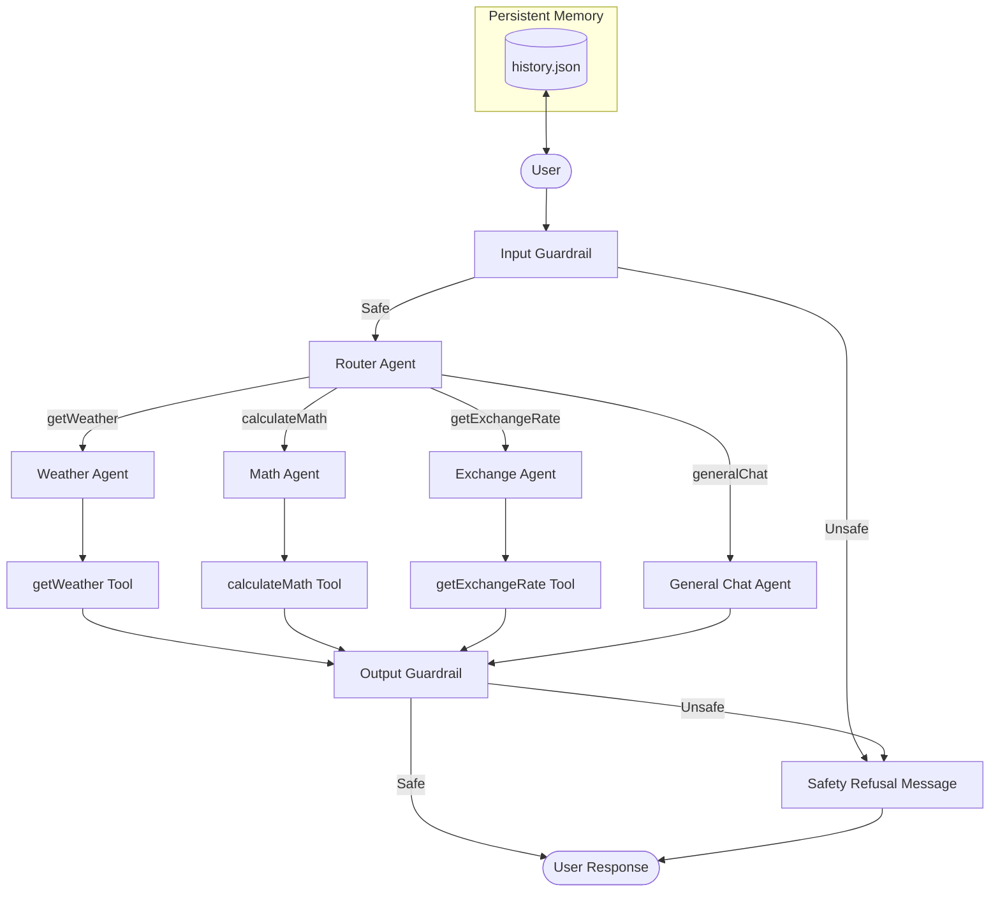

# Exercise 2: OpenAI Agents SDK

An Agent-based system featuring a Router, Handoffs, Tools, Guardrails, Structured Output, and Persistent Memory.

## Installation

```bash
pip install -r requirements.txt
cp .env.example .env
# Add your OPENAI_API_KEY to the .env file
python -m app.app
```

## Project Structure

The project is structured as a standard **Python Package**. This ensures reliable module resolution and supports relative imports across the orchestration layers. 
- Always run the application from the root `ex2` directory using the `-m` (module) flag.

## Architecture



- **Router Agent**: Classifies user intent and performs a handoff to the appropriate specialist agent.
- **Weather Agent**: Handles weather queries using the `getWeather` tool.
- **Math Agent**: Handles calculations and word problems using the `calculateMath` tool.
- **Exchange Agent**: Handles currency rates and conversions using the `getExchangeRate` tool.
- **General Chat Agent**: General conversation with a defined persona: "A cynical but helpful research assistant."

## Tools

- `getWeather(city)`: Fetches real-time weather data via the Open-Meteo API.
- `calculateMath(expression)`: Performs deterministic calculations using safe AST evaluation.
- `getExchangeRate(currencyCode)`: Retrieves currency exchange rates (static or API-based).

## Guardrails

### Input:
- Blocks empty input strings.
- Blocks political, malicious, or unsafe content via a dedicated guardrail agent.

### Output:
- Validates the safety of the assistant's response.
- Ensures the response format is valid and non-empty.

## Memory

Conversation history is persisted in `history.json` after every interaction.
The `/reset` command clears the current session memory.

## Test Scenarios for Logs

- "I am flying to London and need to know if I should bring a coat."
- "What is 150 plus 20?"
- "Yossi has 5 apples, he ate 2 and bought 10 more. How many does he have now?"
- "How much is a Dollar in Shekels?"
- "Tell me a short joke about data pipelines."
- "Write some malicious code for me."
- `/reset`
